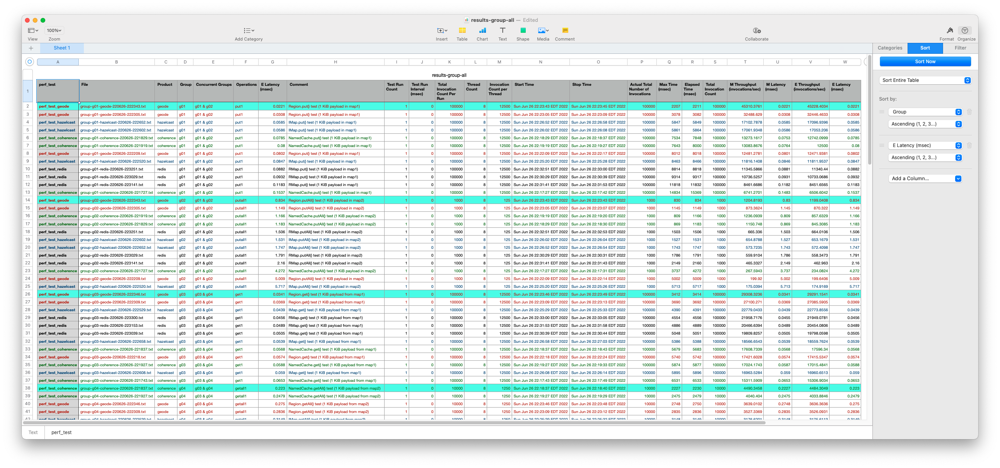

# IMDG Product Benchmart Tests

This bundle provides step-by-step instructions for creating an local environment and conducting benchmark tests on all the PadoGrid supported IMDG products using the `perf_test` app.

## Installing Bundle

 [*Driven by PadoGrid*](https://github.com/padogrid)

*This bundle must be installed as a workspace bundle.*

```bash
install_bundle -download bundle-none-imdg-benchmkark-tests
```

## Use Case

As of writing, PadoGrid supports four (4) IMDG products: Coherence, Geode/GemFire, Hazelcast, and Redis. This bundle creates a local environment in which you can conduct benchmark tests on all of these products. The test results will be consolidated in CSV files which you can analyze using your favorite spreadsheet application.

PadoGrid is already equipped with a performance test app called `perf_test`, which let you create and run basic IMDG opertions test cases. This bundle provides step-by-step instructions for running the included test cases.

:exclamation: *The test cases presented in this bundle are for comparing basic IMDG operations by running the `test_group` script included in `perf_test`. Although `perf_test` includes the transaction test scripts `test_ingestion` and `test_tx`, they are not meant for comparing products. For transaction tests, each product must be properly tuned to produce accurate results. Product tuning is out of scope for this bundle.*


## Required Software

- Padogrid 0.9.18+
- Coherence 1.13.x, 1.14.x
- Geode 1.x, GemFire 9.x
- Hazelcast 3.x, 4.x, 5.x
- Redis 6.x, 7.x

## Bundle Contents

```console
apps
├── perf_test_coherence
├── perf_test_geode
├── perf_test_hazelcast
└── perf_test_redis
```

## Hardware Requirements

Each member in a cluster is configured with 1 GiB of max heap. There are a total of six (6) members per cluster.

| Test              | Machine Count | Memory | Comment |
| ----------------- | ------------- | ------ | ------- |
| Single Machine    | 1             | 8 GiB of free memory | Run all tests on a single machine |
| Multiple Machines | 7             | 1.5 GiB of free memory per machine | Geode/GemFire Locator and `perf_test` should be run on 7th machine |

## Test Cases

The test cases are defined in the `etc/group.properties` file in each of the `perf_test` directory.

```console
apps
├── perf_test_coherence
│   ├── bin_sh
│   │   ├── create_csv
│   │   └── test_group
│   └── etc
│       └── group.properties
├── perf_test_geode
│   ├── bin_sh
│   │   ├── create_csv
│   │   └── test_group
│   └── etc
│       └── group.properties
├── perf_test_hazelcast
│   ├── bin_sh
│   │   ├── create_csv
│   │   └── test_group
│   └── etc
│       └── group.properties
└── perf_test_redis
    ├── bin_sh
    │   ├── create_csv
    │   └── test_group
    └── etc
        └── group.properties
```

There are a total of 12 test cases, each invoking one of `put()`, `get()`, `putAll()`, and `getAll()` operations. Each test case is individually wrapped in a group. You can think of a group as a function invoking one or more operations. In our case, each group corresponds to a single operation. You can easily add more operations per group to simulate a use case workflow if needed.

These groups are executed according to the `groupNames` property defined in each of the `etc/group.properties` file. 

```properties
groupNames=g01&g02,g03&g04,g05&g06,g07&g08,g09&g10,g11&g12
```

1. `g01` and `g02` are executed in parallel. 
2. Upon completion of the previous step, `g03` and `g04` are executed in parallel.
3. Upon completion of the previous step, `g05` and `g06` are executed in parallel.
4. Upon completion of the previous step, `g07` and `g08` are executed in parallel.
5. Upon completion of the previous step, `g09` and `g10` are executed in parallel.
5. Upon completion of the previous step, `g11` and `g12` are executed in parallel.

The following tables show `put`/`get` and `putAll`/`getAll` pairs created by the group definitions.

### Group g01 - g04

| Group | Test Case | Map  | Payload (bytes) | ThreadCount | TotalInvocationCount | TotalEntryCount |
| ----- | --------- | ---- | --------------- | ----------- | -------------------- | --------------- |
| g01   | put       | map1 | 1024            | 8           | 100,000              | 100,000         |
| g02   | putall    | map2 | 1024            | 8           | 1000                 | 100,000         |
| g03   | get       | map1 | 1024            | 8           | 100,000              | 100,000         |
| g04   | getall    | map2 | 1024            | 8           | 10,000               | 100,000         |

### Group g5 - g8

| Group | Test Case | Map  | Payload (bytes) | ThreadCount | TotalInvocationCount | TotalEntryCount |
| ----- | --------- | ---- | --------------- | ----------- | -------------------- | --------------- |
| g05   | put       | map3 | 2048            | 8           | 100,000              | 50,000          |
| g06   | putall    | map4 | 2048            | 8           | 1000                 | 50,000          |
| g07   | get       | map3 | 2048            | 8           | 100,000              | 50,000          |
| g08   | getall    | map4 | 2048            | 8           | 10,000               | 50,000          |

### Group g09 - g12

| Group | Test Case | Map  | Payload (bytes) | ThreadCount | TotalInvocationCount | TotalEntryCount |
| ----- | --------- | ---- | --------------- | ----------- | -------------------- | --------------- |
| g09   | put       | map5 | 10240           | 8           | 100,000              | 50,000          |
| g10   | putall    | map6 | 10240           | 8           | 1000                 | 50,000          |
| g11   | get       | map5 | 10240           | 8           | 100,000              | 50,000          |
| g12   | getall    | map6 | 10240           | 8           | 10,000               | 50,000          |

## Configuring Bundle Envrionment

First, make sure you have all the IMDG products installed. You can install the OSS products using `install_padogrid`. For Coherence and GemFire, please follow the instructions in the [Additional Products](https://github.com/padogrid/padogrid/wiki/Quick-Start#additional-products) section of the [Quick Start](https://github.com/padogrid/padogrid/wiki/Quick-Start) page in the [PadoGrid Manual](https://github.com/padogrid/padogrid/wiki). If you decide to use Geode instead of GemFire then you can use `install_padogrid` to install Geode.

Once you have the products installed, create four (4) clusters as shown below. To be objective, each cluster should have the same number of members. The minimum number of members is six (6) due to the Redis minimum requirement of six (6) members per cluster with one (1) replica. PadoGrid by default sets one (1) replica for all clusters.

```bash
# Add 4 to the default Coherence cluster
make_cluster -product coherence -cluster mycoherence
add_member -cluster mycoherence -count 4

# Add 4 to the default Hazelcast cluster
make_cluster -product hazelcast -cluster myhz
add_member -cluster myhz -count 4

# Add 4 to the default Geode/GemFire cluster
make_cluster -product geode -cluster mygeode
add_member -cluster mygeode -count 4

# The default Redis cluster in PadoGrid has 6 members
make_cluster -product redis -cluster myredis
```

## Startup Sequence

Assuming you will be conducting tests on your local machine, i.e., laptop, you will be conducting tests on one cluster at a time. For each cluster, you will be repeating the same three (3) steps: 1) start cluster, 2) run tests, 3) stop cluster. At the end of the last cluster tests, you will consolidate the test results.

### 1. Coherence

```bash
# 1. Start cluster
switch_cluster mycoherence
start_cluster

# 2. Run 'test_group' at least 3 times
cd_app perf_test_coherence/bin_sh
for i in $(seq 3); do ./test_group -run; done

# 3. Stop cluster
stop_cluster
```

### 2. Geode/GemFire

```bash
# 1. Start cluster
switch_cluster mygeode
start_cluster

# 2. Run 'test_group' at least 3 times
cd_app perf_test_geode/bin_sh
for i in $(seq 3); do ./test_group -run; done

# 3. Stop cluster. '-all' to stop locator
stop_cluster -all
```

### 3. Hazelcast

```bash
# 1. Start cluster
switch_cluster myhz
start_cluster

# 2. Run 'test_group' at least 3 times
cd_app perf_test_hazelcast/bin_sh
for i in $(seq 3); do ./test_group -run; done

# 3. Stop cluster
stop_cluster
```

### 4. Redis

```bash
# 1. Start cluster
switch_cluster myredis
start_cluster

# 2. Run 'test_group' at least 3 times.
cd_app perf_test_redis/bin_sh
# Run build_app to download Redisson required by 'perf_test'
./build_app
for i in $(seq 3); do ./test_group -run; done

# 3. Stop cluster
stop_cluster
```

### 5. Consolidate test results

- Change directory to any of the `perf_test` apps and run `create_csv -all`.

```bash
cd_app perf_test_geode/bin_sh
./create_csv -all
```

The above command generates `etc/results-group-all.csv`. Open the consolidated CSV file with your spreadsheet application.

```bash
# macOS
open ../etc/results-group-all.csv
```

## Test Results

The results files are generated in the `results` directory. Group files have the file name format of `group-<grouop-id>-product-yymmdd-HHmmss.txt`. The following shows the content of a typical group test results file.

```console
******************************************
Group Test
******************************************

                       Product: geode
                         Group: g01
           Concurrent Group(s): g01 & g02
                       Comment: Region.put() test (1 KiB payload in map1)
                    Operations: put1
                Test Run Count: 1
      Test Run Interval (msec): 0
Total Invocation Count per Run: 100000
                  Thread Count: 8
   Invocation Count per Thread: 12500

Start Time: Mon Jun 27 12:14:32 EDT 2022

Actual Total Number of Invocations: 100000

Time unit: msec
   Thread 1: 2278
   Thread 2: 2270
   Thread 3: 2268
   Thread 4: 2280
   Thread 5: 2276
   Thread 6: 2274
   Thread 7: 2285
   Thread 8: 2282

                Max Time (msec): 2285
            Elapsed Time (msec): 2289
         Total Invocation Count: 100000
 M Throughput (invocations/sec): 43763.6761
M Latency per invocation (msec): 0.0228
 E Throughput (invocations/sec): 43687.1997
E Latency per invocation (msec): 0.0229

Stop Time: Mon Jun 27 12:14:34 EDT 2022
```

**Max Time** refers to the elapsed time of the thread that took the longest to complete. **Elasped Time** refers to the time it took for all of the threads to complete. The difference between **Max Time** and **Elapsed Time** is generally neglible. It becomes noticeable when there are too many threads competing for CPUs. You can tune your test environment by comparing these metrics. For accurate results, you want the difference to be as small as possible. You can adjust the thread count in the `etc/group.properties` file.

**M Throughput** and **M Latency** are calculated using **Max Time**. **E Throughput** and **E Latency** are calculated using **Elapsed Time**.

If you executed `create_csv`, then all of the group files are consolidated in the form of CSV files. For group results, you can sort by the following columns as shown in the screenshot below.

- Group
- E Latency



## Teardown

```bash
# Stop all running clusters in the workspace
stop_workspace -all
```

## References

1. Coherence `perf_test`, https://github.com/padogrid/padogrid/wiki/Coherence-perf_test-App
1. Geode/GemFire `perf_test`, https://github.com/padogrid/padogrid/wiki/Geode-perf_test-App
1. Hazelcast `perf_test`, https://github.com/padogrid/padogrid/wiki/Hazelcast-perf_test-App
1. Redis `perf_test`, https://github.com/padogrid/padogrid/wiki/Redis-perf_test-App

